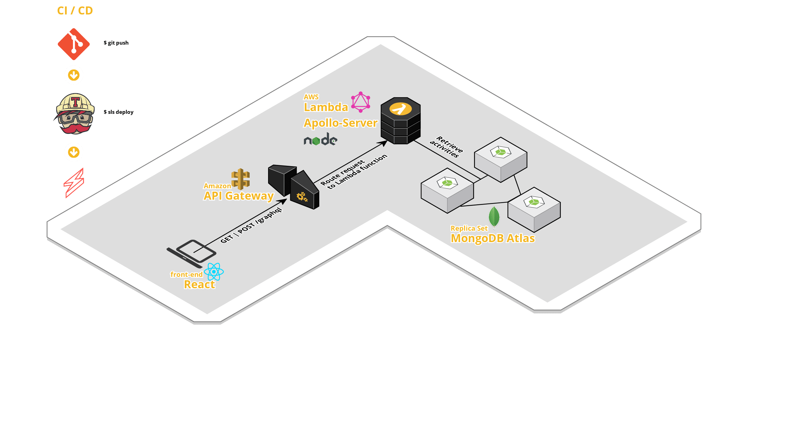

# sls-running

Running log for Philadelphia Marathon training 2018

## Solution Components

### Front-End in React
---
Uses react hooks and Apollo client.  

### Amazon API Gateway
---
To handle `POST` and `GET` requests to `/graphql` endpoint.

### AWS Lambda
---
GraphQL (Apollo) Server hosted as a Lambda function.

### MongoDB Atlas
---
DaaS for MongoDB using a replica set.

### CI / CD
---
Continuous Integration pipeline to deploy automatically when the `master` branch is updated using Travis CI and the Serverless Framework.

